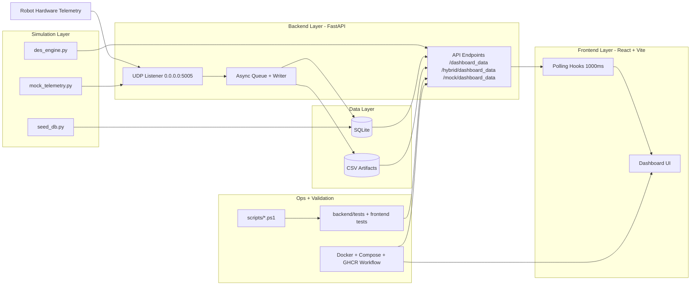

# MVS Project Architecture (Mermaid)

This diagram shows the primary runtime architecture and supporting delivery workflow for the MVS project.

## Notes

- The backend receives both real and simulated telemetry, normalizes it, and persists to SQLite and CSV.
- The frontend dashboard polls backend endpoints, with hybrid mode as the primary operational mode.
- PowerShell scripts and automated tests validate behavior; Docker and CI support packaging and deployment.
