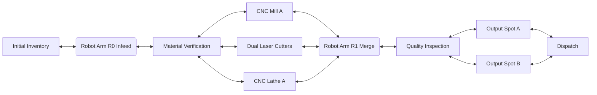

# SentryC2 EARC Testbed Assumptions and Executed Model

Date: 2026-03-30

## 1) Design Intent
This testbed is intentionally modeled as a **triangular branch/merge cell** to represent expeditionary manufacturing where jobs can either:
- take a direct path for simple parts, or
- traverse multiple machining operations for complex parts.

The objective is to mimic a realistic EARC with constrained edge compute, robot-mediated transfer, and queue/block behavior without requiring physical hardware.

## 2) Critical Design Assumptions

### 2.1 Physical Layout (Triangular Topology)
- **Left (Source):** Initial Inventory and Infeed Robot (R0)
- **Center (Divergence):** Material Verification
- **Fabrication Branches:** CNC Mill A, Dual Laser Cutters, CNC Lathe A
- **Merge Point:** Robot Arm R1 (collects from all fabrication branches)
- **Right (Sink):** Quality Inspection -> Output Spot A/B -> Dispatch

### 2.2 Conveyors and Transfer
- All conveyor links are modeled as **bidirectional** (forward production + rework return).
- Robot hubs are mandatory handoff points for cross-branch movement.
- Conveyors carry state (`ACTIVE`/`IDLE`) from live job transitions.

### 2.3 Processing Logic
- Four part families are generated: `gasket`, `shaft`, `housing`, `bracket`.
- Each family has a route with at least one of:
  - single fabrication operation, or
  - **multi-operation sequence** (e.g., lathe -> mill, or mill -> laser).
- `Quality Inspection` may inject rework to `CNC Mill` in ~10% of completions.

### 2.4 Failure/Blocking Behavior
- Robot merge node can enter `Blocked` state (simulated transport contention).
- Quality Inspection can enter `Offline` state (simulated sensor/camera downtime).
- These states force queue accumulation and expose realistic bottleneck shifts.

### 2.5 Capacity and WIP Discipline
- Global active-job cap: 9 concurrent mock jobs.
- Implicit queueing at each node (tracked by queue depth estimate).
- Inventory mass depletes with active machining load to emulate material burn-down.

## 3) Mermaid-Style Topology Definition

## 4) Executed Backend Contract
### Endpoint
- `GET /mock/dashboard_data`

### Payload (executed)
- `work_orders[]`: active jobs with route-aware status
- `machine_status[]`: CNC Mill / Dual Laser / Lathe states
- `raw_inventory[]`: current material weights
- `schematic.nodes[]`: includes `id`, `label`, `type`, `status`, `active_jobs`, `queue_depth`, `x`, `y`
- `schematic.connectors[]`: includes `from`, `to`, `active`, `bidirectional`, `kind`

This is compatible with mode switching in frontend hook (`live` vs `mock`).

## 5) Executed Frontend Behavior
- Mode toggle selects:
  - `Live`: `/dashboard_data`
  - `Mock`: `/mock/dashboard_data`
- Schematic renderer uses backend coordinates for node placement.
- Conveyor lines are rendered as directed edges; active lines are highlighted.
- Right panel shows Mermaid-style flow definition and conveyor state list.

## 6) Critical Engineering Notes
- This model is intentionally conservative: bottleneck behavior appears at merge robot and QA, which is realistic for expeditionary cells.
- Bidirectional conveyors are powerful but risky; production deployments should gate reverse movement via explicit rework policy to avoid congestion collapse.
- Capacity control should eventually become explicit per-node (`capacity`, `queue_limit`) rather than inferred from global WIP.
- For mission assurance, future iterations should enforce due-date-aware dispatch rules (`EDD` with critical preemption) and deterministic replay seeds for validation.

## 7) Next Hardening Steps
1. Add per-node capacity constraints and conveyor occupancy tokens.
2. Add dispatch policy plugin (`FIFO`, `SPT`, `EDD`) with comparative telemetry.
3. Add robot reachability matrix and collision exclusion zones.
4. Add event log stream for post-mortem analysis and SLA reporting.
5. Add deterministic scenario fixtures for regression testing.
