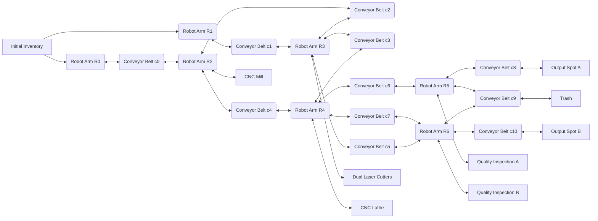

```mermaid
flowchart LR
  ir[Initial Inventory]
  r0(Robot Arm R0)
  r1(Robot Arm R1)
  r2(Robot Arm R2)
  r3(Robot Arm R3)
  r4(Robot Arm R4)
  r5(Robot Arm R5)
  r6(Robot Arm R6)

  c0(Conveyor Belt c0)
  c1(Conveyor Belt c1)
  c2(Conveyor Belt c2)
  c3(Conveyor Belt c3)
  c4(Conveyor Belt c4)
  c5(Conveyor Belt c5)
  c6(Conveyor Belt c6)
  c7(Conveyor Belt c7)
  c8(Conveyor Belt c8)
  c9(Conveyor Belt c9)
  c10(Conveyor Belt c10)

  cncm[CNC Mill]
  lz[Dual Laser Cutters]
  cncl[CNC Lathe]

  qia[Quality Inspection A]
  qib[Quality Inspection B]

  oba[Output Spot A]
  obb[Output Spot B]
  tra[Trash]

  ir --> r0
  ir --> r1

  r0 <--> c0
  r1 <--> c1

  c0 <--> r2
	r2 <--> cncm
	r2 <--> c4
	r2 <--> c2

  c1 <--> r3
	r3 <--> lz
	r3 <--> c2
	r3 <--> c3
	r3 <--> c5

  c4 <--> r4
	r4 <--> cncl
	r4 <--> c3
	r4 <--> c6
	r4 <--> c7

  c7 <--> r6
  c6 <--> r5
  r5 <--> c8
  r5 <--> c9
  c5 <--> r6

  r5 <--> qia
  r6 <--> qib

  c8 <--> oba
  c9<--> tra
  c10 <--> obb
  r6 <--> c10
  r6<--> c9


 
  

```
