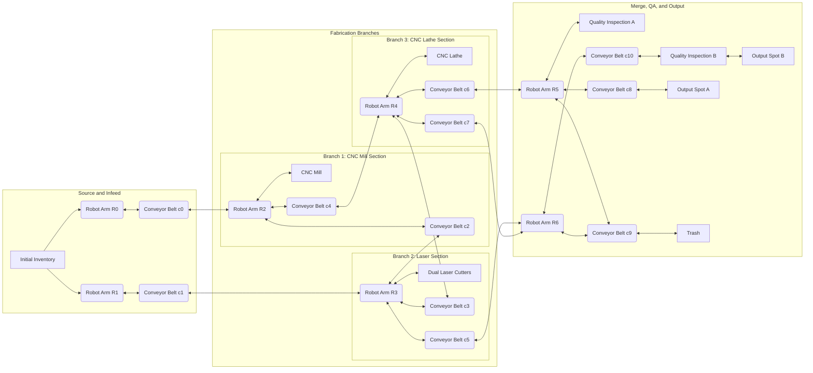

## Notes on this v2 layout
- Preserves your triangular branch-and-merge intent.
- Removes duplicate links and normalizes spacing.
- Splits the graph into clear operational zones for readability.
- Breaks fabrication into three explicit branch sections (mill, laser, lathe).
- Positions Quality Inspection B beneath c10 by linking `c10 <--> qib`.
- Keeps conveyors as explicit nodes so you can later assign occupancy state per belt.
